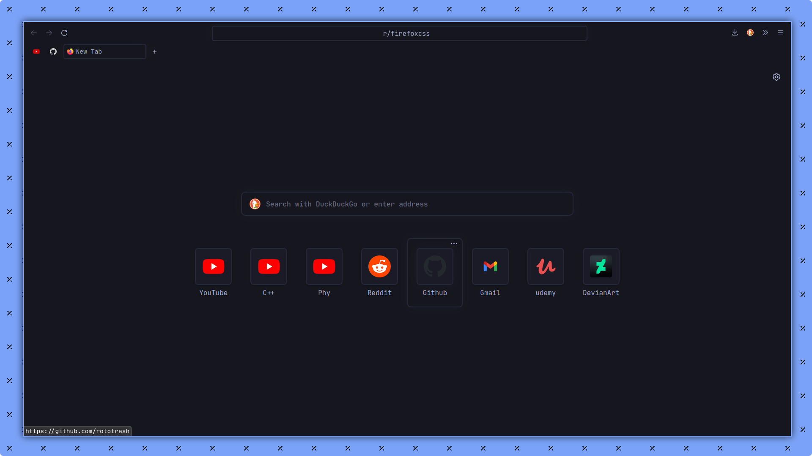
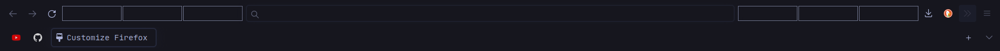
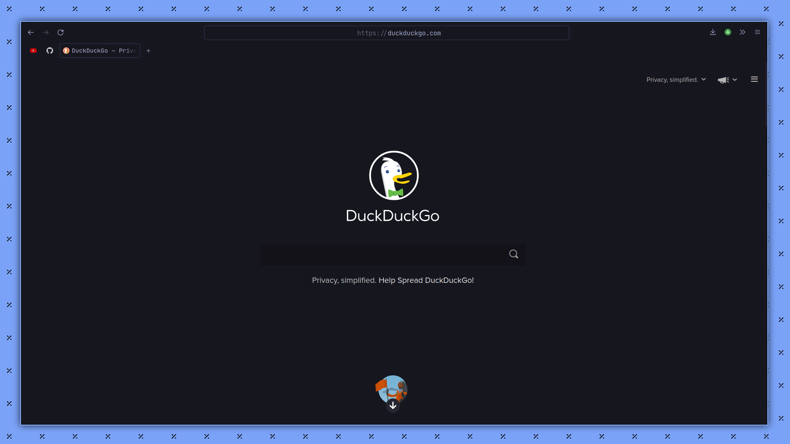
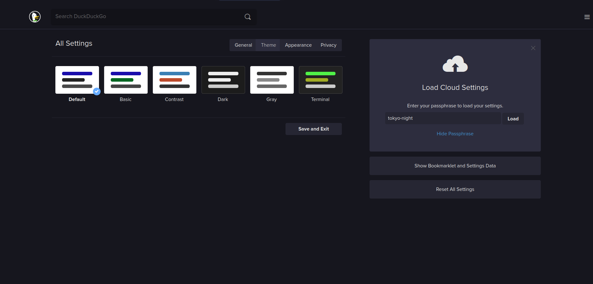

<h1>🗼 tokyo-nightfox 🦊</h1>

`Firefox v95.0` | [`Installation`](https://github.com/rototrash/tokyo-night-fox#installation)

## Installation

1. Go to *`about:config`* and enable *`toolkit.legacyUserProfileCustomizations.stylesheets`*.

2. Locate your profile location by going to *`about:support`* and clicking *`Open Directory`* in *`Profile folder`* (Usually ends with *`.default-release`*)

3. Clone this repository by running `git clone https://github.com/rototrash/tokyo-night-fox.git`.

4. Paste the `chrome` folder into the correct profile folder.

For the blur style to work enable `layout.css.backdrop-filter.enabled` in `about:config`.

5. Copy these customization settings to get the exact spacing and look you see in the preview. You can use the `Flexible Spaces` for the gaps.

## Note:
I highly recommend installing this firefox theme: [`https://addons.mozilla.org/en-US/firefox/addon/tokyo-night-theme/`](https://addons.mozilla.org/en-US/firefox/addon/tokyo-night-theme/) and the JetBrains Mono Nerd font (`yay -S nerd-fonts-jetbrains-mono` if you are on Arch-based system) 

 ## DuckDuckGo

Want to get this DuckDuckGo theme? Go to [`https://duckduckgo.com/settings#theme`](https://duckduckgo.com/settings#theme) and enter the passphrase **`tokyo-night`**.

## Credits

* **Tokyo Night Theme:** [`https://github.com/enkia/tokyo-night-vscode-theme`](https://github.com/enkia/tokyo-night-vscode-theme) 
* **Forked from Nightfox:** [`https://github.com/snthcy/nightfox`](https://github.com/snthcy/nightfox)  
* **Nightfox is based off of:** [`https://github.com/datguypiko/Firefox-Mod-Blur`](https://github.com/datguypiko/Firefox-Mod-Blur)
